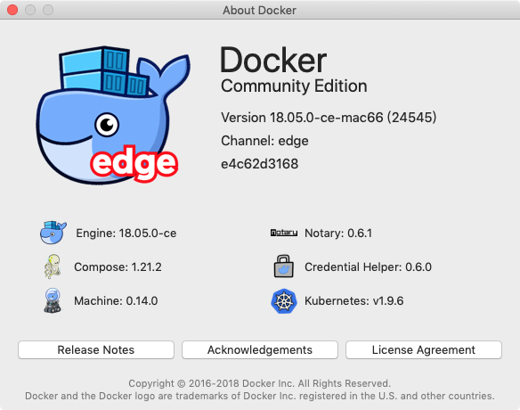
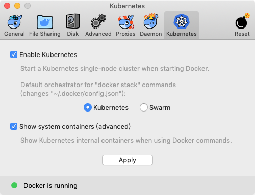
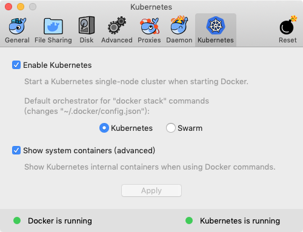
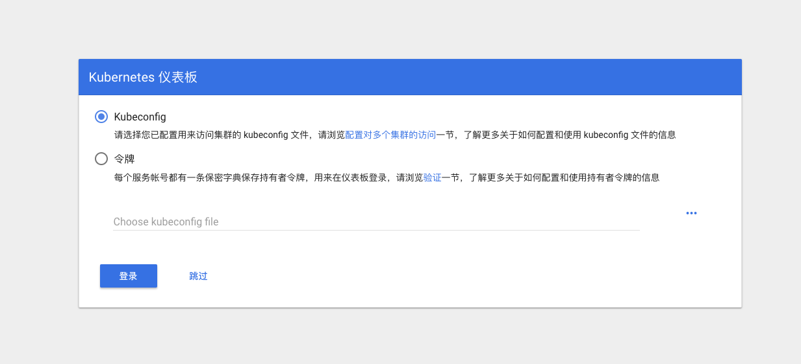
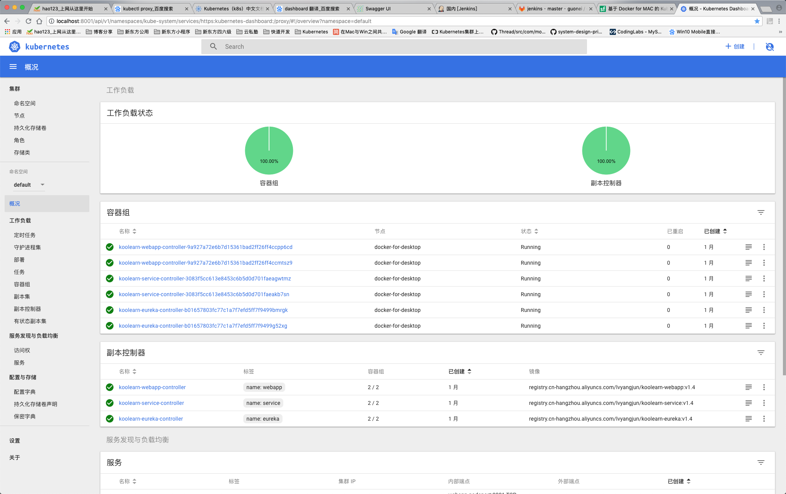
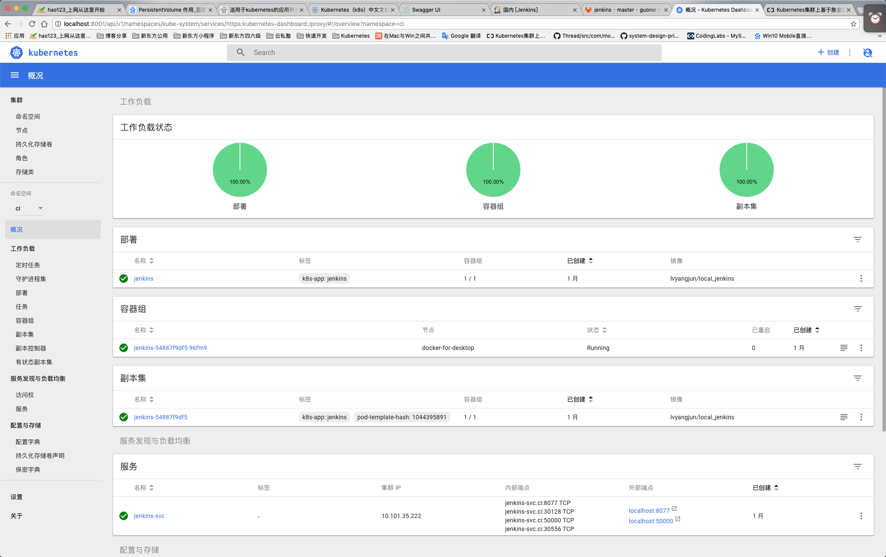
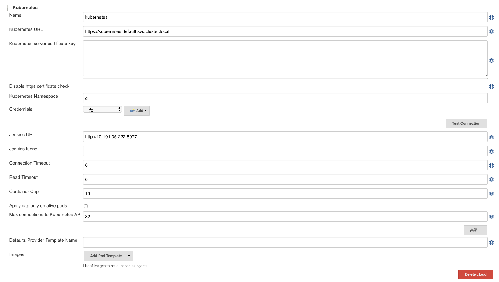
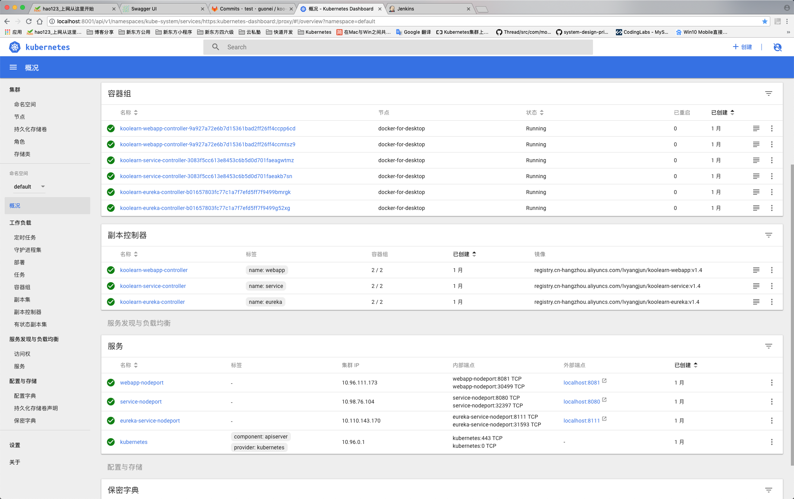

## Kubernetes集群上基于jenkins的CI/CD


### 1.Kubernetes环境搭建

#####1.1环境搭建

本次搭建环境为mac os 环境，安装docker for mac edge,支持Kubernetes



启动docker,点击perferenes 切换到kubernetes 选项，选择enable kubernestes 选择kubernestes 单选按钮，点击apply ,第一次启动会下载相关kubernetes镜像,会比较慢需等待一会；



当kubernetes 状态为为kubernetes is running，表示环境启动成功；



#####1.2配置kubernetes-dashboard

Docker 也为我们安装了 kubectl 控制命令,使用 kubectl 命令来创建简单的 kubernetes-dashboard 服务：

```shell
##安装kubernetes-dashboard
kubectl create -f https://raw.githubusercontent.com/kubernetes/dashboard/master/src/deploy/recommended/kubernetes-dashboard.yaml
secret "kubernetes-dashboard-certs" created
serviceaccount "kubernetes-dashboard" created
role "kubernetes-dashboard-minimal" created
rolebinding "kubernetes-dashboard-minimal" created
deployment "kubernetes-dashboard" created
service "kubernetes-dashboard" created
#通过命名查看deployments和services
kubectl get deployments --namespace kube-system
NAME                   DESIRED   CURRENT   UP-TO-DATE   AVAILABLE   AGE
kube-dns               1         1         1            1           22m
kubernetes-dashboard   1         1         1            0           26s
kubectl get services --namespace kube-system
NAME                   TYPE        CLUSTER-IP      EXTERNAL-IP   PORT(S)         AGE
kube-dns               ClusterIP   10.96.0.10      <none>        53/UDP,53/TCP   22m
kubernetes-dashboard   ClusterIP   10.111.242.95   <none>        443/TCP         30s
```

启动Kubernetes API server启动代理服务器，通过kubectl proxy:

```shell
kubectl proxy

Starting to serve on 127.0.0.1:8001
```

访问dashboard http://localhost:8001/api/v1/namespaces/kube-system/services/https:kubernetes-dashboard:/proxy/,暂时不进行验证进入点击跳过






### 2.Kubernetes上的jenkins server安装及配置

#####2.1构建定制的jenkins server 镜像文件Dockerfile

定制镜像基于jenkins/jenkins:lts，获取maven安装包,安装并配置环境变量，由于Docker容器内的Jenkins使用容器外宿主机的Docker（Docker-outside-of-Docker），并将docker 用户组加入jenkins;

```dockerfile
FROM jenkins/jenkins:lts
USER root
ARG dockerGid=978

RUN wget http://apache-mirror.rbc.ru/pub/apache/maven/maven-3/3.3.9/binaries/apache-maven-3.3.9-bin.tar.gz
RUN tar xzvf apache-maven-3.3.9-bin.tar.gz
RUN cp -R apache-maven-3.3.9 /usr/local/bin
RUN export PATH=apache-maven-3.3.9/bin:$PATH
RUN export PATH=/usr/local/bin/apache-maven-3.3.9/bin:$PATH
RUN ln -s /usr/local/bin/apache-maven-3.3.9/bin/mvn /usr/local/bin/mvn
#RUN ls -l /usr/local/bin
RUN echo $PATH
RUN echo "docker:x:${dockerGid}:jenkins" >> /etc/group \
USER jenkins
```

docker命令构建本地jenkins镜像

```shell
#制作lvyangjun/local_jenkins
docker build -t lvyangjun/local_jenkins .
```

#####2.2kubernetes部署Jenkins server

我们希望jenkins环境和应用是彼此隔离的，单独创建一个ci的namespace，

namespace-ci.yml：

```yaml
apiVersion: v1
kind: Namespace
metadata:
    name: ci
```

为jenkins准备的持久化卷，我们将其挂在到/usr/local/bin/，防止因重启造成的数据丢失， pv.yml

```yaml
apiVersion: v1
kind: PersistentVolume
metadata:
  name: jenkins
  namespace: ci
spec:
  capacity:
    storage: 5Gi
  accessModes:
    - ReadWriteMany
  persistentVolumeReclaimPolicy: Retain
  nfs:
    path: /usr/local/bin/
    server: 127.0.0.1
```

jenkins.yml

Service配置暴露两个端口，一个是Jenkins Server的访问端口，这里nodePort方式指定的是8077；另一个是Jenkins Agent通信用的端口，默认是50000，如果不暴露的话，Jenkins slave节点是无法和Jenkins Server建了连接；

```yaml
kind: PersistentVolumeClaim
apiVersion: v1
metadata:
  name: jenkins
  namespace: ci
spec:
  accessModes:
    - ReadWriteMany
  resources:
    requests:
      storage: 5Gi
---
apiVersion: v1
kind: ServiceAccount
metadata:
  name: jenkins
  namespace: ci
---
apiVersion: rbac.authorization.k8s.io/v1beta1
kind: ClusterRoleBinding
metadata:
  name: jenkins
roleRef:
  apiGroup: rbac.authorization.k8s.io
  kind: ClusterRole
  name: cluster-admin
subjects:
- kind: ServiceAccount
  name: jenkins
  namespace: ci

---
apiVersion: extensions/v1beta1
kind: Deployment
metadata:
  name: jenkins
  namespace: ci
spec:
  replicas: 1
  template:
    metadata:
      labels:
        k8s-app: jenkins
    spec:
      serviceAccount: jenkins
      containers:
      - name: jenkins
        image: lvyangjun/local_jenkins
        imagePullPolicy: IfNotPresent
        volumeMounts:
        - mountPath: /var/jenkins_home
          name: home
      volumes:
        - name: home
          persistentVolumeClaim:
            claimName: jenkins

---
apiVersion: v1
kind: Service
metadata:
  name: jenkins-svc
  namespace: ci
spec:
  ports:
  - port: 8077
    targetPort: 8080
    name: web
  - port: 50000
    targetPort: 50000
    name: slave
  selector:
    k8s-app: jenkins
  type: LoadBalancer
```

下面是部署jenkins的命令：

```shell
#创建ci namespace
kubectl apply -f namespace-ci.yml

#请求pv
kubectl apply -f pv.yml

#部署jenkins镜像
kubectl apply -f jenkins.yml

kubectl get pods -n ci
```

##### 2.3jenkins配置

通过kubernetes-dashboard,切换到ci 命名空间，我们通过访问外部端口http://localhost:8077 访问jenkins



通过kubernetes-dashboard 日志查看初始化密码，全部安装推荐jenkins插件，设置用户名密码，完成初始化设置；

##### 2.4 Jenkins kubernetes plugin动态分配资源

首先进入插件管理页面【系统管理】->【管理插件】->【可选插件】，搜索kubernetes plugin,勾选要安装的插件，然后点击【直接安装】。


单击【系统管理】 - >【系统设置】，找到【云】，然后点击【新增一个云】

 

name：kubernetes 
禁用https证书检查：true 
kubernetes URL：[https：//kubernetes.default.svc.cluster.local](https://kubernetes.default.svc.cluster.local/)
JenkinsURL：http://10.101.35.222:8077(jenkins 集群IP+端口)
连接超时：5 
读取超时：15

这样就配置好了kubernetes-plugin，可以实现动态jenkins-slaves in pod。

### 3.应用Docker镜像构建及编排

#####3.1应用架构介绍

本次分享demo以小教室为例，对其做了spring-boot改造，以jar文件方式运行；具体见gitlab http://git.koolearn-inc.com/guonei/demo.git项目

#####3.2应用镜像构建及编排

以koolearn-service为例,编写Dockerfile和koolearn-service_rc.yml

应用镜像以frolvlad/alpine-oraclejdk8:slim为基础，将Git 拉去下来的代码编译后的jar 加入到镜像中，设置Jvm 参数;启动以java -jar 启动

Dockerfile：

```dockerfile
FROM frolvlad/alpine-oraclejdk8:slim
ARG module
ARG jenkins_build_path
#VOLUME /tmp
COPY $jenkins_build_path/$module-0.0.1-SNAPSHOT.jar /app.jar
RUN ls -lh /
RUN sh -c 'touch /app.jar'
ENV JAVA_OPTS=""
ENTRYPOINT [ "sh", "-c", "java $JAVA_OPTS -Djava.security.egd=file:/dev/./urandom -jar /app.jar" ]
```

koolearn-service_rc.yml:

```yaml
apiVersion: v1
kind: ReplicationController  
metadata:  
  name: koolearn-webapp-controller
spec:  
  replicas: 2                            
  selector:  
    name: webapp
  template:  
    metadata:  
      labels:
        name: webapp
    spec:  
      containers:  
        - name: koolearn-webapp
          image: registry.cn-hangzhou.aliyuncs.com/lvyangjun/koolearn-webapp:v1.3
          imagePullPolicy: IfNotPresent
          ports:
            - containerPort: 8081
---
apiVersion: v1
kind: Service
metadata:
  name: webapp-nodeport
spec:
  ports:
    - port: 8081
      targetPort: 8081
  type: LoadBalancer
  selector:
    name: webapp
```


### 4. jenkins slave 镜像构建

##### 4.1构建定制的jenkins slave 镜像文件Dockerfile

定制镜像基于registry.cn-hangzhou.aliyuncs.com/google-containers/jnlp-slave:alpine，下载kubectl 文件并加入到镜像，修改其执行权限并移动到/usr/local/bin/目录下，并将docker 用户组加入jenkins;

```dockerfile
FROM registry.cn-hangzhou.aliyuncs.com/google-containers/jnlp-slave:alpine

# File Author / Maintainer
MAINTAINER lvyangjun
ENV KUBECTL_VERSION=v1.7.0
USER root
# Install kubectl
ADD kubectl kubectl
RUN chmod +x kubectl \
  && mv kubectl /usr/local/bin/kubectl

ARG dockerGid=999
RUN echo "docker:x:${dockerGid}:jenkins" >> /etc/group \
USER jenkins
```


###5. jenkins job配置

pipeline方式创建一个如下的Jenkins构建任务：

构建参数：

 module 为模块名称项目保持一致

 env为环境git分支，根据加载不同配置

 git_tag 为每次选择的Git 提交tag (git parameter需要安装jenkins插件 )


下面为pipeline脚本，其语法可根据，Jenkins提供的工具来生成


#####jenkins job pipeline编写

pipeline 分为三个stages：

a.Checkout 代码

b.Maven构建api和对应module

c.jenkins在kubernetes动态分配slave节点，完成镜像构建、镜像 tag 、镜像push、 kubectl 命令部署镜像或滚动更新（部署在kubernester default namespace 下进行）

```json
pipeline {
    agent any
    stages {
        stage('Checkout') {
            steps {
                echo 'Checkout'
                checkout([$class: 'GitSCM', branches: [[name: '*/master']], doGenerateSubmoduleConfigurations: false, extensions: [], submoduleCfg: [], userRemoteConfigs: [[credentialsId: 'd0bad3f5-87b6-4097-91ed-e27c97cf028d', url: 'http://git.koolearn-inc.com/guonei/demo.git']]])
            }
        }
        
        stage('Maven Build') {
            steps {
                echo 'Maven Building'
                sh 'cd api&&mvn clean install -P${env}  -DskipTests -U'
                sh 'cd ${module}&&mvn clean package -P${env}  -DskipTests -U'
            }
        }
    }
}
podTemplate(label: 'docker-pod',  containers: [
    containerTemplate(
            name: 'jnlp',
            image: 'registry.cn-hangzhou.aliyuncs.com/lvyangjun/jnlp-slave:alpine',
            args: '${computer.jnlpmac} ${computer.name}',
            command: ''
        )
  ],volumes: [
        persistentVolumeClaim(mountPath: '/home/jenkins', claimName: 'jenkins', readOnly: false),
        hostPathVolume(hostPath: '/var/jenkins_home', mountPath: '/home/jenkins'),
        hostPathVolume(hostPath: '/var/run/docker.sock', mountPath: '/var/run/docker.sock'),
        hostPathVolume(hostPath: '/usr/local/bin/docker', mountPath: '/usr/local/bin/docker'),
        //hostPathVolume(hostPath: '/usr/local/bin/kubectl', mountPath: '/usr/local/bin/kubectl'),
        hostPathVolume(hostPath: '/tmp/', mountPath: '/tmp/')
]) 
{
    node ('docker-pod') {
        
        container('jnlp') {
            
            stage('Docker building') {
                echo 'Docker building ${git_tag}'
                sh("docker build -t lvyangjun/${module}:${git_tag} --build-arg module=${module} --build-arg jenkins_build_path=./target ${module}")
                echo 'Docker Login'
                sh("docker login --username=lvyangjun2010@163.com --password='password' registry.cn-hangzhou.aliyuncs.com")
                echo 'Docker tag -${git_tag}'
                sh("docker tag lvyangjun/${module}:${git_tag} registry.cn-hangzhou.aliyuncs.com/lvyangjun/${module}:${git_tag}")
                echo 'Docker tag'
                sh("docker push  registry.cn-hangzhou.aliyuncs.com/lvyangjun/${module}:${git_tag}")
                echo 'kubectl'
                //sh "cd ${module}&&kubectl apply -f ${module}_rc.yml -n default"
                sh 'kubectl rolling-update ${module}-controller -n default --image=registry.cn-hangzhou.aliyuncs.com/lvyangjun/${module}:${git_tag}'
            }
        }
    }
}
```


### 6.执行构建任务：

执行构建任务，选择git_tag，开始构建


完成构建基本可以在kubernetes-dashboard，查看构建成功后的服务；

